# Documentation on CSS grid and flex
## Table Of Contents
## Grid
1. grid container
2. grid items
3. grid lines
4. grid-areas
5. grid-gap
6. grid-auto
7. Other Properties
-  justify and align 
-  place
-  Values and their Properties
-  Difference between autofit and autofill
-  Other Properties
## Flex
1. flex Container
2. flex-direction
3. flex-wrap
4. flex-flow
5. justify-content
6. align-items
7. Order
8. flex-grow and shrink
 ____
## Grid
### 1. grid container
Grid containers consist of grid items, placed inside columns and rows.To make an HTML element behave as a grid container, you have to set the display property to grid or inline-grid.
- display-grid

        .grid-container 
        {
            display: grid;
        }
    is used to create the layout based on rows and columns  
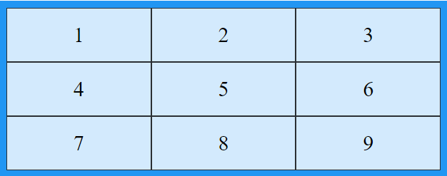

        .grid-container 
        {
            display: inline-grid;
        }
    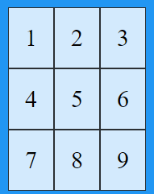
    
    is used to make an inline grid container

|grid  | inline-Grid | 
| :---        |    :----:   |
|Grid is used to create layout based on rows and columns|Inline grid is used to create smaller, more compact layouts that are contained within a single line of text|
### 2. grid-items
- grid-column
    
    grid-column property  is to specify on which column to place an item, and how many columns the item will span.

        .item1 
        {
        grid-column: 1 / span 2;
        }
    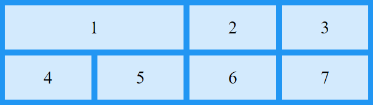
      
- grid-row
    
    grid-row property is to specify on which row to place an item, and how many row the item will span.

        .item1 
        {
          grid-row: 1 / span 2;
        }
    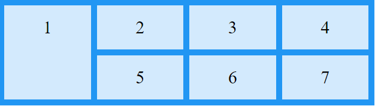
    ---
    
### 3. grid-lines
- grid-template-columns
    
    grid-template-columns property to define the number of columns in the grid layout.This grid layout has four columns 
        
        .grid-container 
        {
            display: grid;
            grid-template-columns: auto auto auto auto;
        }
    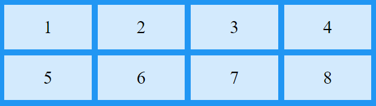

- grid-template-rows
    
    grid-template-rows property to define the size of the rows in a grid layout.The first row in this grid is 100px high, and the second row is 300px high.
        
        .grid-container 
        {
            display: grid;
            grid-template-rows: 100px 300px;
        }
    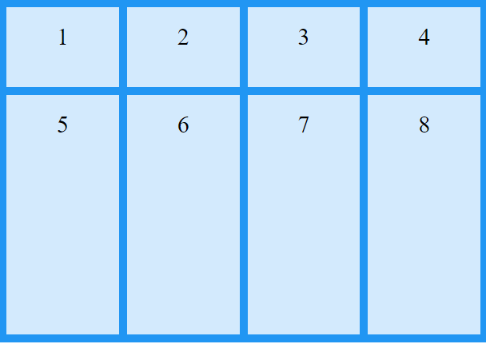
    ---
### 4. grid areas
grid-areas
     
 grid-areas property to specify where to place an item.The syntax is grid-row-start / grid-column-start / grid-row-end / grid-column-end.Item1 will start on row 2 and column 1, and span 2 rows and 3 columns.
     
    .item1 
    {
       grid-area: 2 / 1 / span 2 / span 3;
    }
    
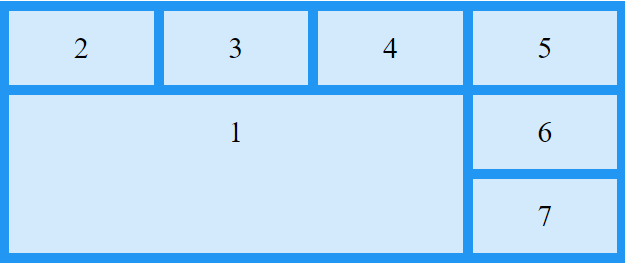
### 5. Grid gap
- grid-gap

    grid-gap property to specify the size of the gap between the rows, and between the columns.This grid has a 50px gap between both the **rows** and the **columns**

        .grid-container 
        {
            grid-gap: 50px;
        }
    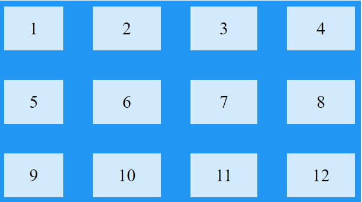
- grid-row-gap

    grid-row-gap property to specify the size of the gap between the rows.This grid has a 50px gap between rows 
       
        .grid-container 
        {
            grid-row-gap: 50px;
        }
    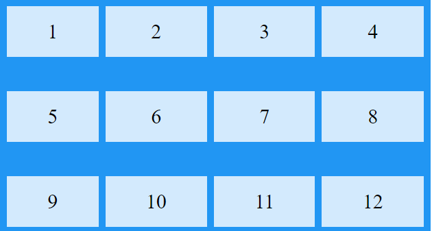
- grid-column-gap

    grid-column-gap property to specify the size of the gap between the rows.This grid has a 50px gap between **columns**

        .grid-container 
        {
            grid-column-gap: 50px;
        }
    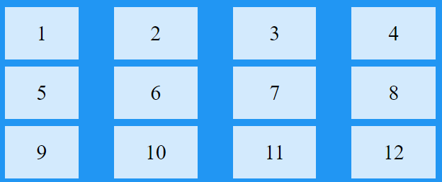
---
### 6.grid-auto
- grid-auto-flow
    
    grid-auto-flow property controls how auto-placed items are inserted in the grid.This grid has three columns and two rows.This will Insert items column by column.

        .grid-container 
        {
            display: grid;
            grid-auto-flow: column;
        }
    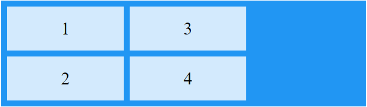
- grid-auto-columns
    
    grid-auto-columns property to set a default size (width) for all columns.Set the size to 50 pixels per column

        .grid-container 
        {
            display: grid;
            grid-auto-columns: 50px;
        }
    **NOTE: grid-template-columns overrides this property**
    
- Justify and Align

|Common | Axis | Aligns|Applies to|
| :---        |    :----  | :---|:---|
|justify-content   align-content | inline(x-axis)   block(y-axis) | content within element(effectively adjusts padding)|block containers,flex containers and grid containers
|justify-self   align-self| inline    block | element within parent (effectively adjusts margin)|block level boxes,absolutely positioned boxes and grid items  absolutely positioned boxes,flex-items,grid-items
|justify-items   align-items | inline   block | items inside box (controls child items)|block containers and grid containers   flex-containers and grid-containers
---

|justify-content|justify-items|
|:---:|:---:|
|This property aligns the grid along the row axis|Aligns the content inside a grid item along the row axis|
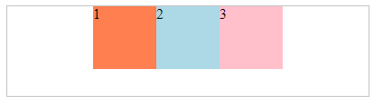|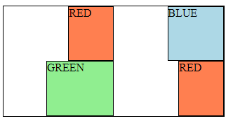
---
|align-content|align-items|
|:---:|:---:|
|This property aligns the grid along the column axis|Aligns the content inside a grid item along the column axis|
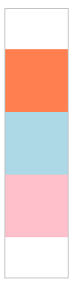|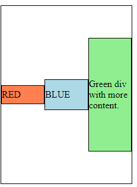
---
- place

|place-content |place-items| place-self|
| :---:       |    :----:| :---:|
|Specify the flex lines to align towards the bottom of the flex container, and align the flex items with the same space between them horizontally|place each 
 element at the start of its grid cell in the inline and block directions|Align an individual grid item at the end in the block and inline directions|
-  Values and their Properties

|Values  | Properties | 
| :---        |   :---- |
|stretch|fills the whole height of the cell (this is the default)|
|start|aligns items to be flush with the start edge of their cell|
|end|aligns items to be flush with the start edge of their cell|
|center|aligns items in the center of their cell|
|baseline|align items along text baseline. There are modifiers to baseline - first baseline and last baseline which will use the baseline from the first or last line in the case of multi-line text.|
space-around|places an even amount of space between each grid item, with half-sized spaces on the far ends|
space-between|places an even amount of space between each grid item, with no space at the far ends|
space-evenly| places an even amount of space between each grid item, including the far ends|
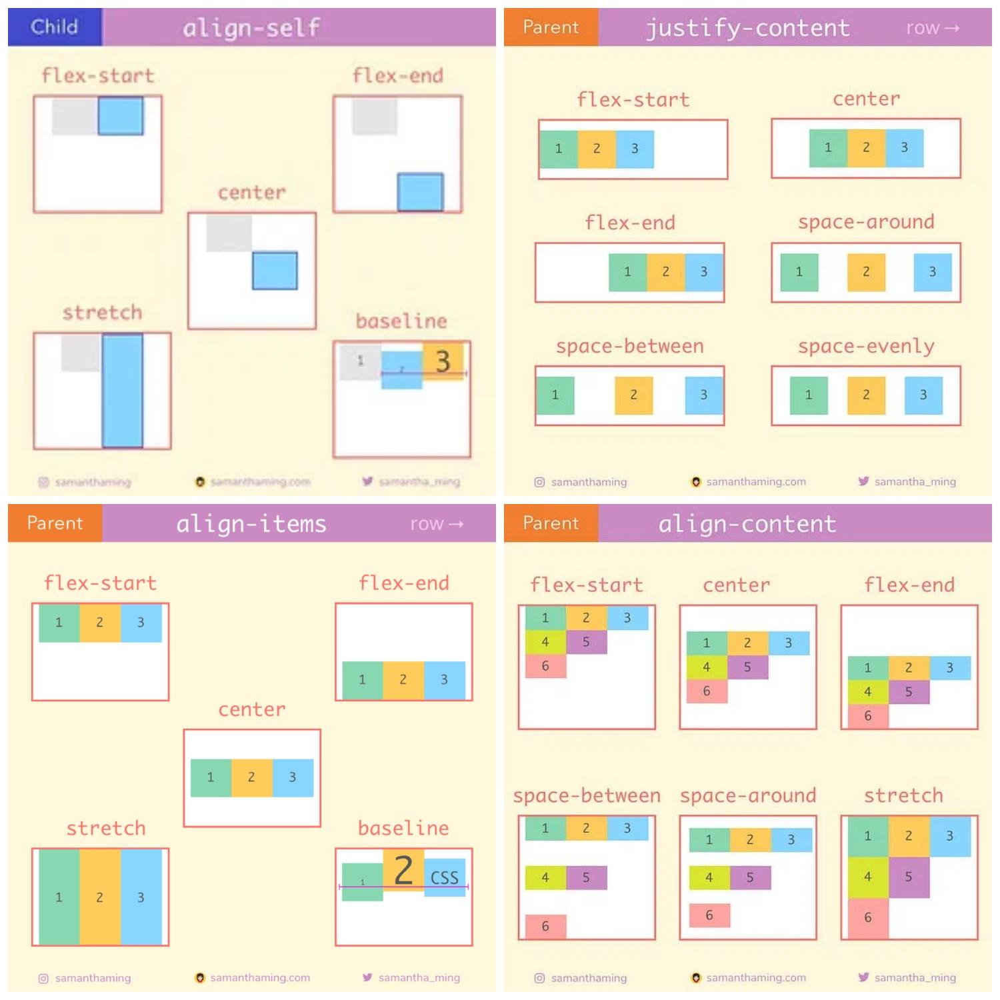
---
-  Difference between auto-fit and auto-fill

|auto-fit   | auto-fill | 
| :---        |    :----:   |
|The browser will allow empty columns to occupy space in a row. | The content will stretch to fill the entire row width. | 
| Grid layout remains fixed with or without items. |    Grid layout is not fixed ,the content stretch to fit entire width.  |
| Shifting of items in a grid is possible as there are vacant space in a row. |    Shifting of items in a grid is not  possible.  |
---
|Properties   | Description | 
| :---        |    :----  |
|grid-column-start  |grid-column-start property to   specify on which column to start displaying the item |
| grid-column-end |grid-column-end property to specify on which column to stop displaying the item (or how many columns the item will span)| 
|grid-row-start  | grid-row-start property to specify on which row to start displaying the item |
| grid-row-end | grid-row-end property to specify on which row to stop displaying the item (or how many rows the item will span). | 
|minmax() | This is used to define a size range greater than or equal to min and less than or equal to max | 
|repeat()| The first argument specifies the number of times that the track list should be repeated.It is specified with an integer value of 1 or more, or with the keyword values auto-fill or auto-fit.The second argument specifies the set of tracks that will be repeated. | 
---
## Flex
### 1. flex-container
The parent element containing flex items
    
        .container
        {
            display:self;
        }
 CSS columns have no effect on a flex container.
### 2. flex-direction
Flex items are placed in the flex container.Think of flex items as primarily laying out either in horizontal rows or vertical columns.

    .container 
    {
    flex-direction: row | row-reverse | column | column-reverse;
    }

|Values  | Properties | 
| :---        |    :----:   |
|row (default)|left to right in ltr; right to left in rtl|
|row-reverse|right to left in ltr; left to right in rtl|
|column|same as row but top to bottom|
|column-reverse|same as row-reverse but bottom to top|
### 3.flex-wrap
 flex items will all try to fit onto one line. You can change that and allow the items to wrap as needed with this property.

    .container
    {
    flex-wrap: nowrap | wrap | wrap-reverse;
    }
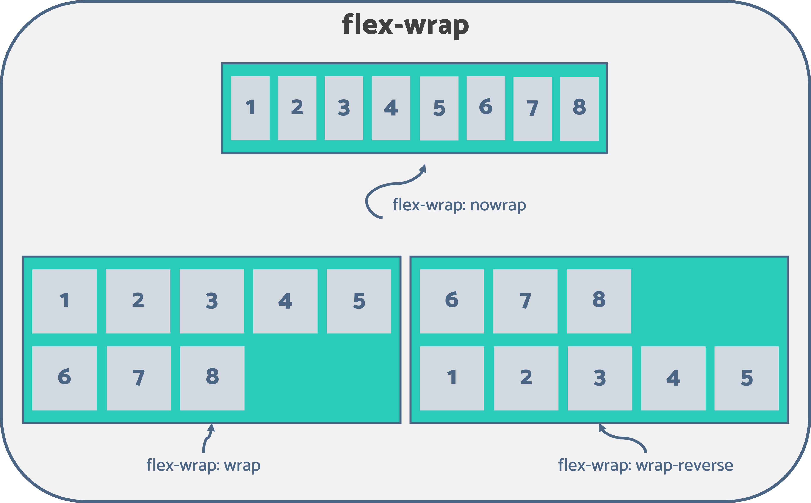    
|Values  | Properties | 
| :---        |    :----:   |
|no-wrap|all flex items will be on one line|
|wrap|flex items will wrap onto multiple lines, from top to bottom|
|wrap-reverse|flex items will wrap onto multiple lines from bottom to top|
---
### 4.flex-flow
This is a shorthand for the flex-direction and flex-wrap properties, which together define the flex container’s main and cross axes. The default value is row nowrap.

    .container 
    {
      flex-flow: column wrap;
    }
### 5. justify content
This defines the alignment along the main axis. It helps distribute extra free space leftover when either all the flex items on a line are inflexible, or are flexible but have reached their maximum size. It also exerts some control over the alignment of items when they overflow the line.

    .container 
    {
      justify-content: flex-start | flex-end |  center | space-between | space-around | space-evenly | start | end | left | right ... + safe | unsafe;
    }
 
|Properties   | Description | 
| :---        |    :----:   |
|flex-start (default)| items are packed toward the start of the flex-direction|
|flex-end|items are packed toward the end of the flex-direction|
|stretch|fills the whole height of the cell (this is the default)|
|start|aligns items to be flush with the start edge of their cell|
|end|aligns items to be flush with the start edge of their cell|
|left|items are packed toward left edge of the container, unless that doesn’t make sense with the flex-direction, then it behaves like start.|
|right|items are packed toward right edge of the container, unless that doesn’t make sense with the flex-direction, then it behaves like end.|
|center|aligns items in the center of their cell|
space-around|places an even amount of space between each grid item, with half-sized spaces on the far ends|
space-between|places an even amount of space between each grid item, with no space at the far ends|
space-evenly| places an even amount of space between each grid item, including the far ends|
### 6.align-items
This defines the default behavior for how flex items are laid out along the cross axis on the current line. Think of it as the justify-content version for the cross-axis (perpendicular to the main-axis)
 
    .container {
     align-items: stretch | flex-start | flex-end | center | baseline | first baseline | last baseline | start | end | self-start |  unsafe;
    }
 
|Properties   | Description | 
| :---:       |    :----:   |
|Baseline|align items along text baseline. There are modifiers to baseline - first baseline and last baseline which will use the baseline from the first or last line in the case of multi-line text.

Apart from this baseline all the values applies as same as the justify-content
### 7. order
By default, flex items are laid out in the source order. However, the order property controls the order in which they appear in the flex container.

    .item {
     order: 5; /* default is 0 */
    }
 
### 8.flex-grow and shrink
- Flex-grow
    This defines the ability for a flex item to grow if necessary. It accepts a unitless value that serves as a proportion. It dictates what amount of the available space inside the flex container the item should take up.If all items have flex-grow set to 1, the remaining space in the container will be distributed equally to all children. If one of the children has a value of 2, that child would take up twice as much of the space either one of the others (or it will try, at least).
        .item 
        {
         flex-grow: 4; /* default 0 */
         }
- Flex-shrink
    This defines the ability for a flex item to shrink if necessary.
 
**Negative numbers are invalid.**

